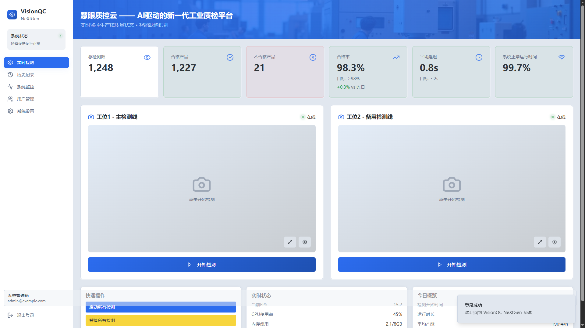
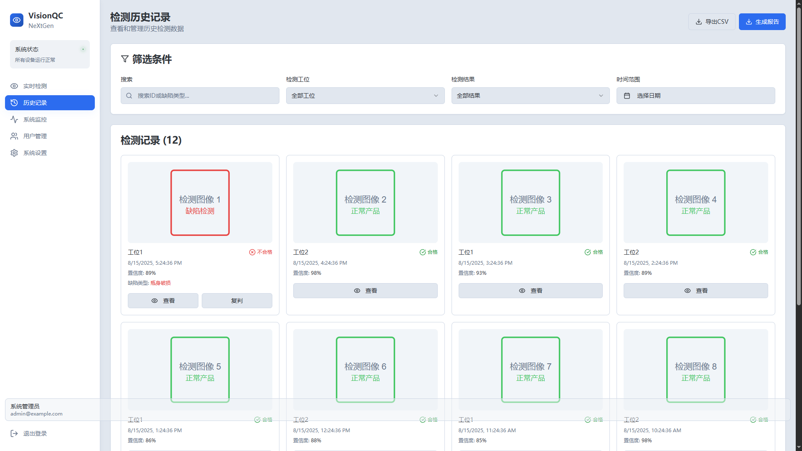
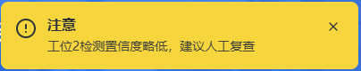
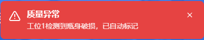
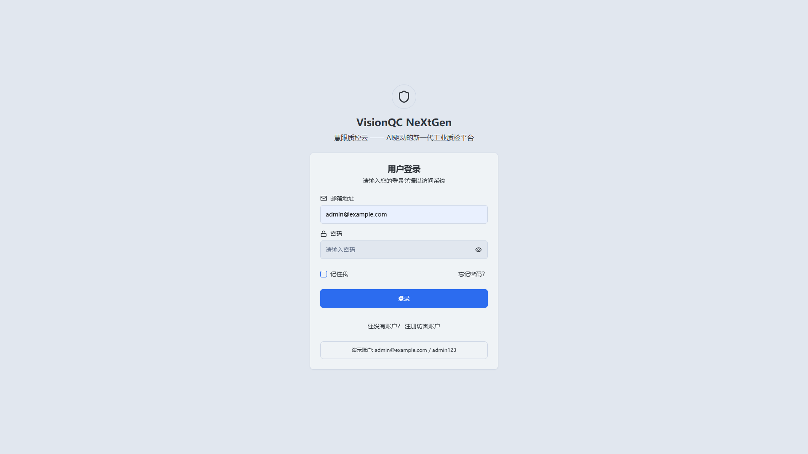

# VisionQC NeXtGen | 慧眼质控云  

<div align="center">



**AI-Powered Industrial Vision Quality Control System**  
**AI驱动的新一代工业视觉质检平台**

[](https://opensource.org/licenses/MIT)
[](https://reactjs.org/)
[](https://www.typescriptlang.org/)
[](https://vitejs.dev/)

[English](#english) | [中文](#中文)

</div>

---

## English

### 🎯 Overview

VisionQC NeXtGen is a modern, AI-powered industrial vision quality control system designed for real-time defect detection and quality monitoring in manufacturing environments. Built with cutting-edge web technologies, it provides an intuitive interface for operators and administrators to monitor production lines, analyze quality metrics, and manage detection history.

### ✨ Key Features

- **🔍 Real-time Quality Monitoring**: Live dashboard with production statistics and quality metrics
- **📹 Multi-Camera Support**: Monitor multiple workstations simultaneously with live video feeds
- **🤖 AI-Powered Detection**: Intelligent defect recognition with confidence scoring
- **📊 Comprehensive Analytics**: Detailed quality reports and trend analysis, like: 

- **🚨 Smart Alerts**: Real-time notifications for quality issues and system status, like: 


- **👥 Role-Based Access**: Secure authentication with admin, operator, and guest roles
- **📱 Responsive Design**: Optimized for desktop, tablet, and mobile devices
- **🌐 Bilingual Interface**: Full support for English and Chinese languages

### 🛠 Technology Stack

#### Frontend
- **React 18.3.1** - Modern UI library with hooks and functional components
- **TypeScript 5.8.3** - Type-safe development with enhanced IDE support
- **Vite 5.4.19** - Fast build tool and development server
- **Tailwind CSS 3.4.17** - Utility-first CSS framework
- **shadcn/ui** - High-quality, accessible UI components

#### State Management & Data
- **React Query** - Server state management and caching
- **React Hook Form** - Performant forms with easy validation
- **Zod** - TypeScript-first schema validation

#### Routing & Navigation
- **React Router DOM 6.30.1** - Declarative routing for React

#### Charts & Visualization
- **Recharts 2.15.4** - Composable charting library for React

### 🚀 Quick Start

#### Prerequisites
- Node.js 18+ 
- npm or yarn package manager

#### Installation

```bash
# Clone the repository
git clone https://github.com/your-org/visionqc-nextgen.git
cd visionqc-nextgen

# Install dependencies
npm install

# Start development server
npm run dev
```

The application will be available at `http://localhost:5173` !



#### Default Login Credentials
- **Username**: admin
- **Password**: admin123
- **Role**: Administrator

### 📁 Project Structure

```
VisionQC-NeXtGen/
├── public/                 # Static assets
├── src/
│   ├── components/         # Reusable UI components
│   │   ├── dashboard/      # Dashboard-specific components
│   │   ├── layout/         # Layout and navigation
│   │   └── ui/             # Base UI components (shadcn/ui)
│   ├── hooks/              # Custom React hooks
│   ├── lib/                # Utility functions
│   ├── pages/              # Application pages/routes
│   └── assets/             # Images and static files
├── docs/                   # Documentation
└── package.json
```

### 📖 Documentation

- [Architecture Guide](docs/DevelopmentDocs/architecture.md) - System design and component relationships
- [API Documentation](docs/API/api.md) - Data structures and API specifications
- [Deployment Guide](docs/DevelopmentDocs/deployment.md) - Production deployment instructions
- [Development Guide](docs/DevelopmentDocs/development.md) - Development setup and guidelines
- [User Manual](docs/User-Guide/user-guide.md) - Complete user guide for operators
- [Troubleshooting](docs/DevelopmentDocs/troubleshooting.md) - Common issues and solutions

### 🤝 Contributing

We welcome contributions! Please see our [Contributing Guidelines](CONTRIBUTING.md) for details.

1. Fork the repository
2. Create a feature branch (`git checkout -b feature/amazing-feature`)
3. Commit your changes (`git commit -m 'Add amazing feature'`)
4. Push to the branch (`git push origin feature/amazing-feature`)
5. Open a Pull Request

### 📄 License

This project is licensed under the MIT License - see the [LICENSE](LICENSE) file for details.

---

## 中文

### 🎯 项目概述

慧眼质控云（VisionQC NeXtGen）是一个现代化的AI驱动工业视觉质量控制系统，专为制造环境中的实时缺陷检测和质量监控而设计。采用前沿的Web技术构建，为操作员和管理员提供直观的界面来监控生产线、分析质量指标和管理检测历史。

### ✨ 核心功能

- **🔍 实时质量监控**: 实时仪表板显示生产统计和质量指标
- **📹 多摄像头支持**: 同时监控多个工位的实时视频流
- **🤖 AI智能检测**: 智能缺陷识别与置信度评分
- **📊 全面分析**: 详细的质量报告和趋势分析，如：

- **🚨 智能告警**: 质量问题和系统状态的实时通知，如：


- **👥 角色权限管理**: 支持管理员、操作员和访客角色的安全认证
- **📱 响应式设计**: 针对桌面、平板和移动设备优化
- **🌐 双语界面**: 完整支持中英文双语

### 🛠 技术栈

#### 前端技术
- **React 18.3.1** - 现代化UI库，支持Hooks和函数式组件
- **TypeScript 5.8.3** - 类型安全开发，增强IDE支持
- **Vite 5.4.19** - 快速构建工具和开发服务器
- **Tailwind CSS 3.4.17** - 实用优先的CSS框架
- **shadcn/ui** - 高质量、可访问的UI组件库

#### 状态管理与数据
- **React Query** - 服务器状态管理和缓存
- **React Hook Form** - 高性能表单与简易验证
- **Zod** - TypeScript优先的模式验证

#### 路由与导航
- **React Router DOM 6.30.1** - React声明式路由

#### 图表与可视化
- **Recharts 2.15.4** - React可组合图表库

### 🚀 快速开始

#### 环境要求
- Node.js 18+ 
- npm 或 yarn 包管理器

#### 安装步骤

```bash
# 克隆仓库
git clone https://github.com/your-org/visionqc-nextgen.git
cd visionqc-nextgen

# 安装依赖
npm install

# 启动开发服务器
npm run dev
```

应用将在 `http://localhost:5173` 可用！


#### 默认登录凭据
- **用户名**: admin
- **密码**: admin123
- **角色**: 管理员

### 📁 项目结构

```
VisionQC-NeXtGen/
├── public/                 # 静态资源
├── src/
│   ├── components/         # 可复用UI组件
│   │   ├── dashboard/      # 仪表板专用组件
│   │   ├── layout/         # 布局和导航
│   │   └── ui/             # 基础UI组件 (shadcn/ui)
│   ├── hooks/              # 自定义React Hooks
│   ├── lib/                # 工具函数
│   ├── pages/              # 应用页面/路由
│   └── assets/             # 图片和静态文件
├── docs/                   # 文档
└── package.json
```

### 📖 文档

- [架构指南](docs/DevelopmentDocs/architecture.md) - 系统设计和组件关系
- [API文档](docs/api/api.md) - 数据结构和API规范
- [部署指南](docs/DevelopmentDocs/deployment.md) - 生产环境部署说明
- [开发指南](docs/DevelopmentDocs/development.md) - 开发环境设置和规范
- [用户手册](docs/User-Guide/user-guide.md) - 操作员完整使用指南
- [故障排除](docs/DevelopmentDocs/troubleshooting.md) - 常见问题和解决方案

### 🤝 贡献

我们欢迎贡献！请查看我们的[贡献指南](CONTRIBUTING.md)了解详情。

1. Fork 仓库
2. 创建功能分支 (`git checkout -b feature/amazing-feature`)
3. 提交更改 (`git commit -m 'Add amazing feature'`)
4. 推送到分支 (`git push origin feature/amazing-feature`)
5. 开启 Pull Request

### 📄 许可证

本项目采用 MIT 许可证 - 查看 [LICENSE](LICENSE) 文件了解详情。

---

<div align="center">
For Industrial Quality Control  
为工业质量控制而生

</div>